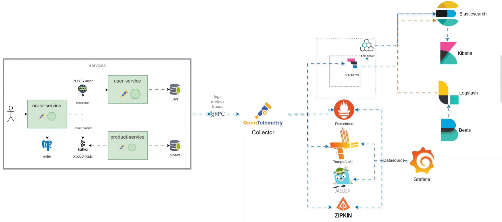

# Spring Advanced Observability Demo

[](https://www.elastic.co/elasticsearch/)
[](https://www.elastic.co/logstash/)
[](https://www.elastic.co/kibana/)
[](https://www.elastic.co/fleet/)
[](https://www.elastic.co/apm/)
[](https://www.elastic.co/beats/filebeat)
[](https://www.elastic.co/beats/metricbeat)
[](https://prometheus.io/)
[](https://grafana.com/oss/loki/)
[](https://grafana.com/)
[](https://grafana.com/oss/tempo/)
[](https://www.jaegertracing.io/)
[](https://zipkin.io/)
[](https://opentelemetry.io/docs/collector/)
[](https://akhq.io/)
[](https://zookeeper.apache.org/)
[](https://kafka.apache.org/)
[](https://www.mongodb.com/)
[](https://github.com/mongo-express/mongo-express)
[](https://axoniq.io/)
[](https://min.io/)
[](https://www.postgresql.org/)
[](https://www.java.com/)
[](https://spring.io/projects/spring-boot)

## Project Overview

The **Spring Advanced Observability Demo** is a comprehensive project designed to demonstrate advanced observability
techniques using the Spring Boot framework. This project integrates multiple powerful tools and technologies to provide
a full-stack observability solution, including tracing, logging, and monitoring of microservices.

## Architecture Overview



## Getting Started

1. **Clone the repository**:
   ```bash
   git clone https://github.com/watlas/spring-advanced-observability-demo.git
   ```

2. **Navigate to the project directory**:
   ```bash
   cd spring-advanced-observability-demo
   ```

3. **Enter the docker directory**:
   ```bash
    cd docker
    ```
4. **setup docker compose**:
   ```bash
   docker-compose setup
   ```

5. **Start the services using Docker Compose**:
   ```bash
   docker-compose up -d
   ```
To generate an order and observe the system's logs, metrics, and traces, follow these steps:

1. Access the Order Service:
   - Open your web browser and navigate to http://localhost:8527/swagger.
   - Use the Swagger UI to generate a new order by interacting with the available API endpoints.

2. Observe Logs, Metrics, and Traces:
   
   | Service       | User      | Password   | URL                                       |
   |---------------|-----------|------------|-------------------------------------------|
   | Kibana        | `elastic` | `changeme` | [localhost:5601](http://localhost:5601)   |
   | Grafana       | `grafana` | `changeme` | [localhost:3000](http://localhost:3000)   |
   | Prometheus    | -         | -          | [localhost:9090](http://localhost:9090)   |
   | Jaeger        | -         | -          | [localhost:16686](http://localhost:16686) |
   | Zipkin        | -         | -          | [localhost:9411](http://localhost:9411)   |
   | Mongo Express | `mongo`   | `changeme` | [localhost:8081](http://localhost:8081)   |
   | AKHQ          | -         | -          | [localhost:8080](http://localhost:8080)   |


##
