# Spring Advanced Observability Demo

[](https://www.elastic.co/elasticsearch/)
[](https://www.elastic.co/logstash/)
[](https://www.elastic.co/kibana/)
[](https://www.elastic.co/fleet/)
[](https://www.elastic.co/apm/)
[](https://www.elastic.co/beats/filebeat)
[](https://www.elastic.co/beats/metricbeat)
[](https://prometheus.io/)
[](https://grafana.com/oss/loki/)
[](https://grafana.com/)
[](https://grafana.com/oss/tempo/)
[](https://www.jaegertracing.io/)
[](https://zipkin.io/)
[](https://opentelemetry.io/docs/collector/)
[](https://akhq.io/)
[](https://zookeeper.apache.org/)
[](https://kafka.apache.org/)
[](https://www.mongodb.com/)
[](https://github.com/mongo-express/mongo-express)
[](https://www.postgresql.org/)
[](https://www.java.com/)
[](https://spring.io/projects/spring-boot)

## Project Overview

The **Spring Advanced Observability Demo** is a comprehensive project designed to demonstrate advanced observability
techniques using the Spring Boot framework. This project integrates multiple powerful tools and technologies to provide
a full-stack observability solution, including tracing, logging, and monitoring of microservices.

## Architecture Overview


## Getting Started

1. **Clone the repository**:
   ```bash
   git clone https://github.com/watlas/spring-advanced-observability-demo.git
   ```

2. **Navigate to the project directory**:
   ```bash
   cd spring-advanced-observability-demo
   ```

3. **Enter the docker directory**:
   ```bash
    cd docker
    ```
4. **setup docker compose**:
   ```bash
    docker compose up setup
   ```
5. **Build the services using Docker Compose**:
   ```bash
   docker-compose build
   ```

6. **Start the services using Docker Compose**:
   ```bash
   docker-compose up -d
   ```
To generate an orderDTO and observe the system's logs, metrics, and traces, follow these steps:

1. Access the Order Service:
   - Open your web browser and navigate to http://localhost:8527/swagger-ui/index.html#/Order/save.
   - Use the Swagger UI to generate a new orderDTO by interacting with the available API endpoints.

2. Observe Logs, Metrics, and Traces:

   | Service       | User      | Password   | URL                                       |
   |---------------|-----------|------------|-------------------------------------------|
   | Kibana        | `elastic` | `changeme` | [localhost:5601](http://localhost:5601)   |
   | Grafana       | `grafana` | `changeme` | [localhost:3000](http://localhost:3000)   |
   | Prometheus    | -         | -          | [localhost:9090](http://localhost:9090)   |
   | Jaeger        | -         | -          | [localhost:16686](http://localhost:16686) |
   | Zipkin        | -         | -          | [localhost:9411](http://localhost:9411)   |
   | Mongo Express | `mongo`   | `changeme` | [localhost:8081](http://localhost:8081)   |
   | AKHQ          | -         | -          | [localhost:8080](http://localhost:8080)   |

3. Example POST request to create an orderDTO:
   - Alternatively, you can use the following `curl` command to create an orderDTO:

   ```bash
   curl -X POST http://localhost:8527/order \
   -H "Content-Type: application/json" \
   -d '{
     "user": {
       "name": "John Doe"
     },
     "product": {
       "name": "Widget",
       "description": "A very useful widget",
       "price": 19.99
     }
   }'

## Some things you will be able to see when uploading this project

### APM Service Map
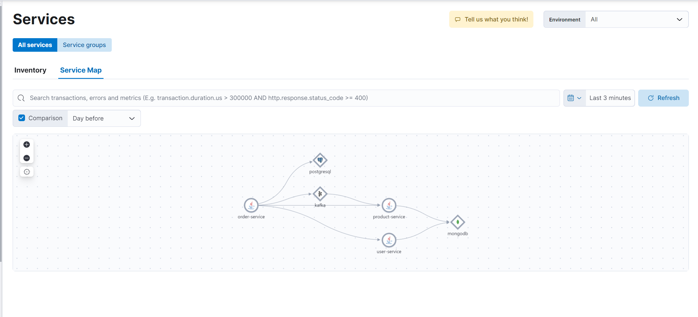

### APM Traces
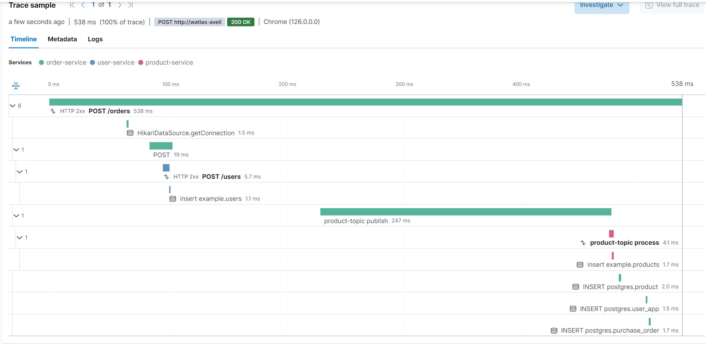

### APM Dependencies
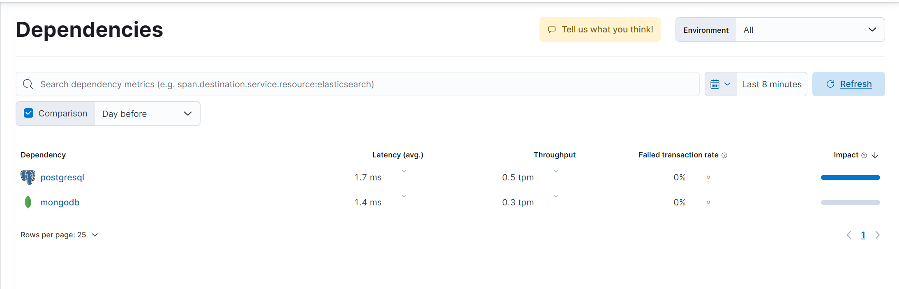

### Dashboard for overview of the system
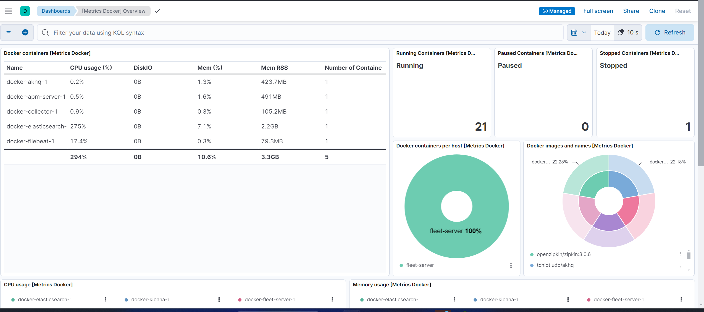


### Kibana Data Discovery
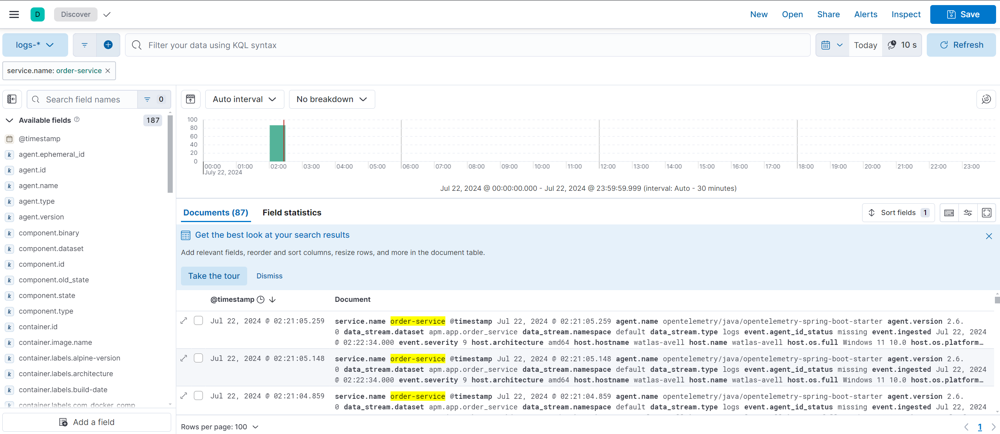

### Agent Management with Fleet
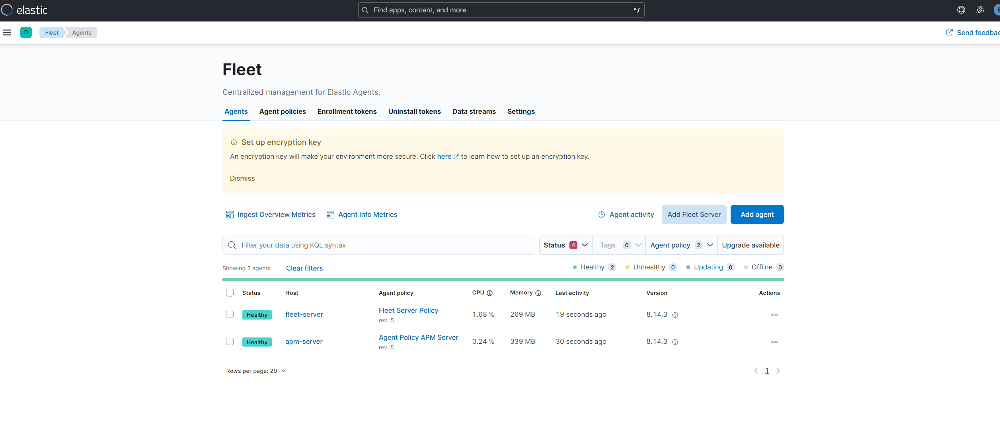

### Cluster Overview
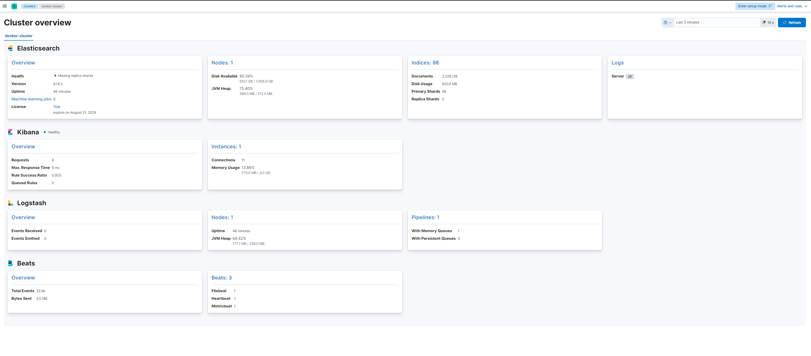

### Grafana Dashboard for Spring  
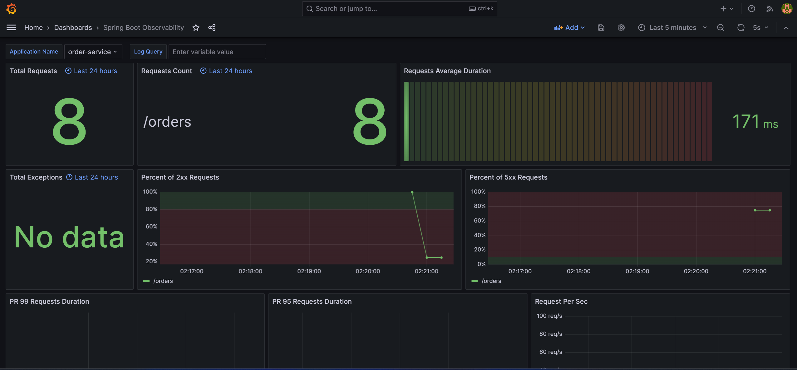

### Grafana Dashboard for OpenTelemetry
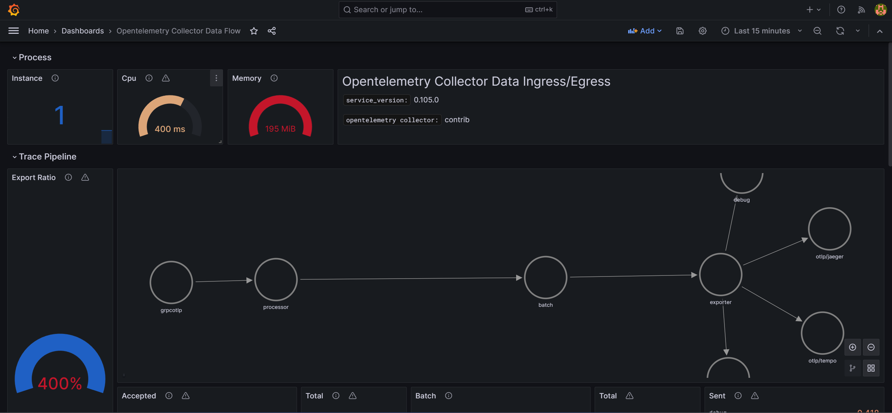

### Monitoring Trace with Jaeger
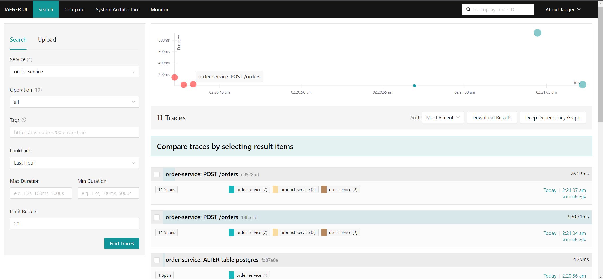

### Monitoring Trace Details with Jaeger
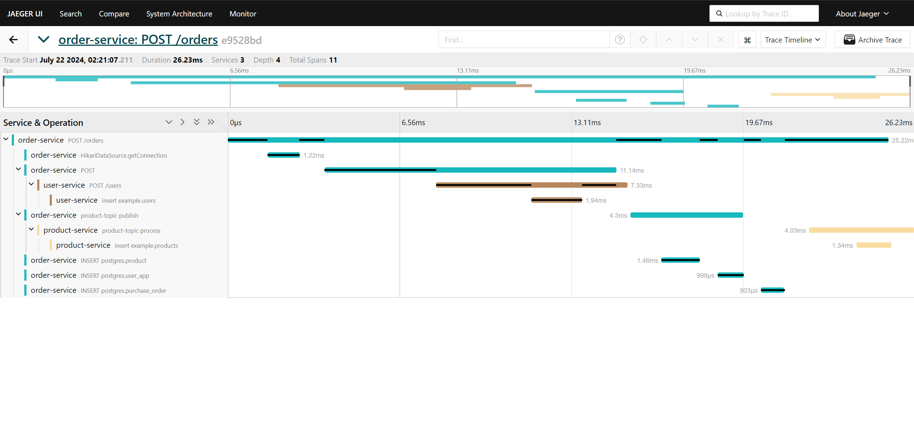

### Monitoring Trace with Zipkin
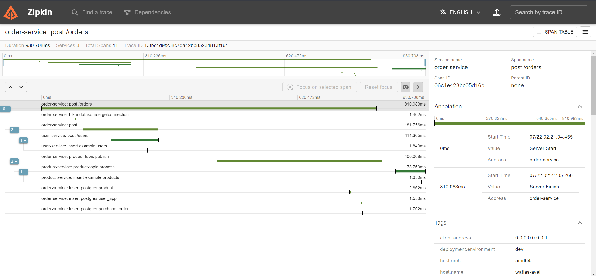

### Monitoring Service Map with Zipkin
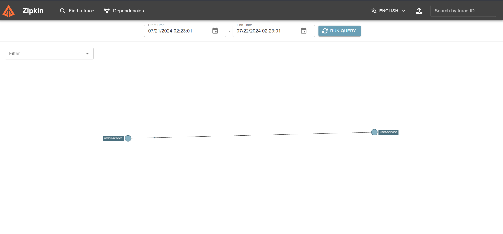


## Referências

### Spring Boot
- [Spring Boot Documentation](https://docs.spring.io/spring-boot/docs/current/reference/html/)
- [Spring Boot GitHub Repository](https://github.com/spring-projects/spring-boot)
- [Building an Application with Spring Boot](https://spring.io/guides/gs/spring-boot/)

### Docker
- [Docker Documentation](https://docs.docker.com/)
- [Docker GitHub Repository](https://github.com/docker/docker-ce)
- [Getting Started with Docker](https://www.docker.com/get-started)

### OpenTelemetry
- [OpenTelemetry Documentation](https://opentelemetry.io/docs/)
- [OpenTelemetry GitHub Repository](https://github.com/open-telemetry/opentelemetry-java)
- [OpenTelemetry Spring Boot Instrumentation](https://github.com/open-telemetry/opentelemetry-java-instrumentation/tree/main/instrumentation/spring/spring-boot)

### Elastic Stack
- [Elasticsearch Documentation](https://www.elastic.co/guide/en/elasticsearch/reference/current/index.html)
- [Logstash Documentation](https://www.elastic.co/guide/en/logstash/current/index.html)
- [Kibana Documentation](https://www.elastic.co/guide/en/kibana/current/index.html)
- [Elastic APM Documentation](https://www.elastic.co/guide/en/apm/get-started/current/index.html)
- [Fleet and Elastic Agent](https://www.elastic.co/guide/en/fleet/current/index.html)
- [Docker ELK](https://github.com/deviantony/docker-elk)

### Grafana
- [Grafana Documentation](https://grafana.com/docs/grafana/latest/)
- [Grafana GitHub Repository](https://github.com/grafana/grafana)
- [Getting Started with Grafana](https://grafana.com/docs/grafana/latest/getting-started/getting-started-prometheus/)

### Prometheus
- [Prometheus Documentation](https://prometheus.io/docs/introduction/overview/)
- [Prometheus GitHub Repository](https://github.com/prometheus/prometheus)
- [Getting Started with Prometheus](https://prometheus.io/docs/prometheus/latest/getting_started/)

### Jaeger
- [Jaeger Documentation](https://www.jaegertracing.io/docs/latest/)
- [Jaeger GitHub Repository](https://github.com/jaegertracing/jaeger)
- [Getting Started with Jaeger](https://www.jaegertracing.io/docs/latest/getting-started/)

### Zipkin
- [Zipkin Documentation](https://zipkin.io/pages/documentation.html)
- [Zipkin GitHub Repository](https://github.com/openzipkin/zipkin)
- [Getting Started with Zipkin](https://zipkin.io/pages/quickstart)
